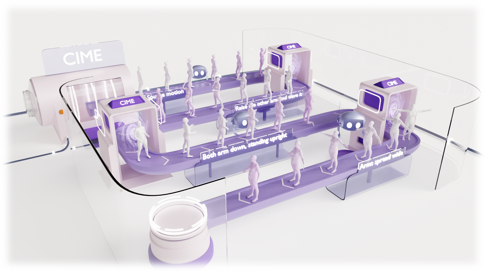

<p align="center">
  
</p>

<h1 align="center">CIME: Continuous Implicit Motion Editing</h1>

<p align="center">
  Balancing Temporal Change and Rhythm Invariance via Fused Gromov-Wasserstein Alignment
</p>

<p align="center">
  <a href='https://github.com/ZhenwuShi/CIME'>
    
  </a>
  <a href='https://github.com/rocket-ycyer/OmniME'>
    
  </a>
</p>

---

CIME extends [OmniME](https://github.com/rocket-ycyer/OmniME) with a **Continuous Implicit Aligner** based on Fused Gromov-Wasserstein (FGW) optimal transport. Given a source motion and an editing instruction, it allows the target sequence length to change, while preserving the source motion's physical rhythm and global temporal topology.

## Environment & Data Setup

Our data and environment follow [SimMotionEdit](https://github.com/lzhyu/SimMotionEdit.git) and [OmniME](https://github.com/rocket-ycyer/OmniME). Please refer to [motionfix](https://github.com/atnikos/motionfix) to download the dataset and set up the environment, then place the data in the corresponding locations.

The STANCE dataset can be downloaded from [Baidu Pan](https://pan.baidu.com/s/10it5Ma1AqV9s8fFKzWFW5w?pwd=qk8y) (code: `qk8y`).

## Pretrained Checkpoint

You can download our pretrained checkpoint from [Baidu Pan](https://pan.baidu.com/s/1cotZ1snU-oeF7T-fmigyfA?pwd=3a55) (code: `3a55`). The directory structure follows the same layout as [SimMotionEdit](https://github.com/lzhyu/SimMotionEdit.git).

## Training

```bash
python -u train.py --config-name="train_cls_arch" experiment=cls_arch run_id=CIME
```

## Evaluation

#### Step 1: Extract samples

```bash
python motionfix_evaluate.py \
    folder=/path/to/exp \
    guidance_scale_text_n_motion=2.0 \
    guidance_scale_motion=2.0 \
    data=motionfix
```

#### Step 2: Compute metrics

```bash
python compute_metrics.py folder=/path/to/exp/samples/npys
```

## Demo

```bash
python demo.py \
    folder=/path/to/exp \
    guidance_scale_text_n_motion=2.0 \
    guidance_scale_motion=2.0 \
    data=motionfix
```

## Acknowledgements

Our code is built upon [OmniME](https://github.com/rocket-ycyer/OmniME), and further based on [SimMotionEdit](https://github.com/lzhyu/SimMotionEdit.git) and [motionfix](https://github.com/atnikos/motionfix).

## License

This code is distributed under an MIT LICENSE. We also include the LICENSE of motionfix in this repo. Other third-party datasets and software are subject to their respective licenses.

## Citation

If you use this code, please cite CIME and the OmniME paper it extends:

```bibtex
@misc{shi2026cime,
  title={CIME: Continuous Implicit Motion Editing},
  author={Zhenwu Shi and Jingyu Gong and Wenxi Li and Yuan Fang and Peiwei Wang and Xingzan Wang and Qian Tianwen and Jiao Xie and Lizhuang Ma and Shaohui Lin},
  year={2026},
  howpublished={\url{https://github.com/ZhenwuShi/CIME}}
}

@inproceedings{shi2026omnime,
  title={Omni-Supervised Motion Editing: Balancing Change and Invariance through Positive-Negative Learning},
  author={Zhenwu Shi and Jingyu Gong and Wenxi Li and Yuan Fang and Peiwei Wang and Xingzan Wang and Qian Tianwen and Jiao Xie and Lizhuang Ma and Shaohui Lin},
  booktitle={Proceedings of the IEEE/CVF Conference on Computer Vision and Pattern Recognition (CVPR)},
  year={2026}
}
```
